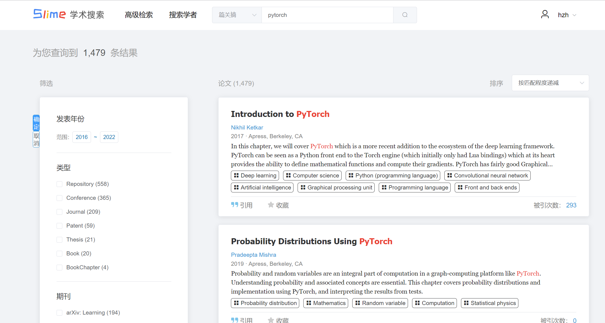
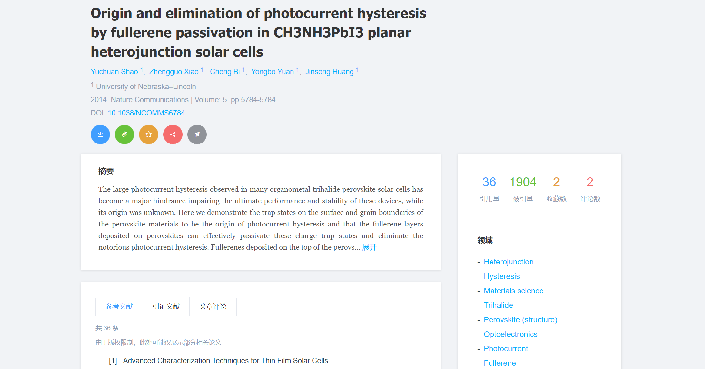
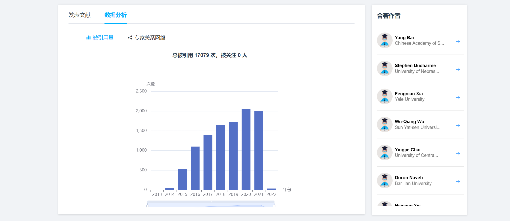
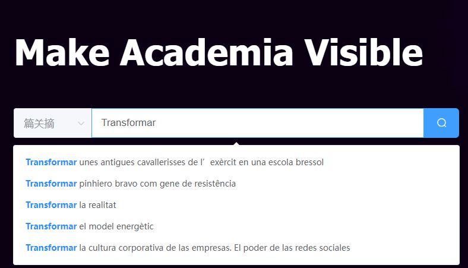

# Slime Scholar 史莱姆学术

> 史莱姆学术成果搜索平台前端，北航大三上软件分析课程大作业

后端地址：https://github.com/BFlameSwift/SlimeScholar-Go

管理平台前端地址：https://github.com/BUAASE-Slime/SlimeScholar-admin

## 项目框架

```tree
master
|-- public
|	|-- favicon.ico
|	|-- global.json	全局数据，含前端、后端部署或运行网址
|	`-- index.html
`-- src
	|-- assets/ 资源，含字体和图像
	|-- components/ 组件
	|-- router/ 路由设置，含全局路由钩子
	|-- store/ 前端localStorage存储
	|-- styles/ 全局css、js样式
	|-- utils/ 全局自定义函数
	|-- views/ 页面组件
	|-- App.vue
	`-- main.js
```

## 运行指南

master分支主要做部署使用，本地运行以dev分支为主。

进入`public/global.json`，修改后端部署路径。（baseUrl可不理会）

1. 安装依赖：`npm install`
2. 本地运行：`npm run serve`
3. 生成部署打包文件：`npm run build`

关于dev分支的说明：同样需要修改`global.json`，但本地运行时，会执行`vue.config.js`的配置，作用是，将后端跑在前端的同域端口下，避免跨域下载等问题。

本项目需结合[后端](https://github.com/BFlameSwift/SlimeScholar-Go)使用。

## 关于Demo

至2022/1/2，项目部署于[slime.matrix53.top](https://slime.matrix53.top/)。

由于本网站的数据量使用了Microsoft Academic Graph的全部数据，需要耗费大量的磁盘空间（500G+)，服务器配置为8核64G。所需配置较高，且由于本网站的许多统计功能均是以数据完整性为前提的，若是数据不完整将会导致统计结果失真。故demo将在服务器到期（2022/1/2）后停止维护。

## 项目介绍

Slime学术成果共享平台，实现了学术搜索引擎的大多基本功能，并增添了部分社交属性，以及对作者以及入驻学者的多样化统计分析。

项目突出特点：

- 多种搜索方式：支持篇关摘、篇名、摘要、文献领域、作者、作者单位、文献来源、DOI等多种方式以较快的速度检索。并且以上都支持单独简单逻辑的高级检索。

  

- 数据全面涵盖广：包含[微软学术](https://academic.microsoft.com/home)至2021年11月的全部作者以及文献，共有**2.7亿**的论文支持检索，并大多情况能以**毫秒级**速度返回结果（100-500ms）。

  

- 支持对搜索结果的多方面聚合，包括但不限于论文类型、论文所属期刊、会议类型、论文出版商等，并全部支持筛选。此外搜索结果支持排序操作，主要包含按照匹配程度递减，按照论文发表年份递增或递减，按照论文被引用量递增或递减。

  

- 文献间的清晰关系，论文的大多引证文献，参考文献以及相关文献均为真实并可直接跳转。

  

- 学者门户多种可视化表示，**实时生成**学者被引用量年份表和学者关系网络图。

  

  

- 首页支持**实时**搜索提示

  

## 致谢

感谢微软提供了[Microsoft Academic ](https://academic.microsoft.com/)全部的开源数据，也是本网站最主要的数据来源。
